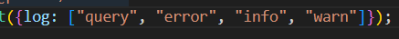

### npm init -y

### npm i prisma typescript ts-node @types/node --save-dev

### npx tsc --init

## npx prisma init

this creates the env and prisam file with default configuration for datasource
and generator Dont forget to update your Db url string in .env

### datasource

it is what our database and its url its autogenerated but we can chanege it eg.
mongodb
you can have one datasource only and url is must


### generator

it defines with generator we use by default its prisma-client-js but we can use
custom diff generators mentioned in docs

you can have multiple generators

it creates our own client lib in nodemodules.

## npx prisma migrate dev --name init

--name is optional this will migratation file and make all the changes Sync with
DB migraiton will contain equivalent .sql file first it creates the migration
then starts the generations

 generates a prisma client in nodemodules everytime
you migrate the changes will me added to our own "Prisam Client"

we need client lib for this

## npx i @prisma/client

this will give us access to our client

## `npx prisma generate`

will auto generate cient for us and give a starter code for us to start using
client

you can create a new client folder and use ts file to work with client you can
pass option to log querries by using

```
export const prismaClient = new PrismaClient({log : ["query"] });
```

you have these many options to log ==>> query, info, warn, error



## wokring with prisma
everything is async so wrap it in trycatch and catch or async

### define script to start
```nodejs
"dev" : "nodemon client/prisma"
```


## Models
models tables
they should at least have id 
every row is a field
every field has 4 cols
1 --> name of field 
2 --> type of field ===>> like Int Id String User     "models can also be type" ===>> BigInt, FLoat, Boolean, DateTime, JSON(only supportedby few)
3 --> type modifiers===>> like ? = options ! = required
4 --> Attributes ==> defines the nature of the field ===>> eg, @default(autoincrement()), @unique, etc


types:
unsupported    --> for when we migrate from diff DB to different DB not all types are supported so this is used to list them
Bytes          --> for byte info
JSON           --> only supported by few